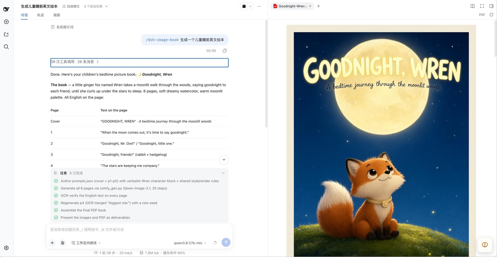

# Awesome DSH Skills

> A collection of skills for [DSH (DeepSeek Harness)](https://github.com/deepseek-ai) — reusable, task-specific instructions that teach an agent how to do a whole job, not just one step.

Each skill in this repository is a self-contained directory with a `SKILL.md` at its root. Drop it into a DSH skills directory, reload the session, and the agent can pick it up by matching your request against the skill's description.



<p align="center"><em><code>dsh-image-book</code> running inside a DSH session — the agent plans the book, generates every page on a local ComfyUI server, OCR-verifies each caption, and assembles the PDF.</em></p>

---

## Skills

| Skill | What it does | Needs |
|-------|--------------|-------|
| [**dsh-image-book**](skills/dsh-image-book/) | Generates complete English picture-comic books (绘本 / 漫画) end to end: story design, character-consistent page prompts, ComfyUI generation, OCR verification of rendered text, PDF binding. | macOS, Python 3.9+, Swift CLI, a local ComfyUI server with Qwen-Image-2.1 |

*More skills land here as they are packaged. Each one keeps its own README with setup and usage detail.*

---

## Install a skill

A skill is a directory containing a `SKILL.md` file. DSH discovers skills from these locations, highest precedence first:

| Scope | Location |
|-------|----------|
| Project | `<project-root>/.dsh/skills/` |
| Project | `<project-root>/.agents/skills/` |
| User | `$DSH_HOME/skills/` (default `~/.dsh/skills/`) |
| User | `~/.agents/skills/` |

*Project root is the nearest ancestor of your working directory containing a `.git` folder.*

**Clone everything, then copy what you want:**

```bash
git clone https://github.com/zhiwehu/awesome_dsh_skills.git
cd awesome_dsh_skills

# user-wide install of one skill
mkdir -p ~/.dsh/skills
cp -R skills/dsh-image-book ~/.dsh/skills/

# or project-local, so it travels with the project
mkdir -p /path/to/project/.dsh/skills
cp -R skills/dsh-image-book /path/to/project/.dsh/skills/
```

Or use the helper, which does the copying for you:

```bash
./install.sh dsh-image-book              # → ~/.dsh/skills/
./install.sh dsh-image-book --agents     # → ~/.agents/skills/
./install.sh --all --project             # every skill → ./.dsh/skills/
```

Reload your DSH session afterwards. Skills are selected by the `description` field in their frontmatter — ask for the outcome ("make me a picture book about a fox"), not the skill name.

---

## Anatomy of a skill

```
my-skill/
├── SKILL.md          ← required: YAML frontmatter (name, description) + the instructions
├── README.md         ← optional: human-facing docs
├── scripts/          ← optional: code the skill runs
├── examples/         ← optional: reference inputs
└── LICENSE
```

`SKILL.md` frontmatter:

```markdown
---
name: my-skill
description: One or two sentences on what this does AND when to use it. This text is the
  only thing the agent sees when deciding whether to load the skill, so put the trigger
  phrases here — including the user's own words, in any language.
---
```

Write the body as instructions to a competent agent: the workflow phases, the exact commands, the constraints that are easy to get wrong, and the failure modes you have actually hit. See [`CONTRIBUTING.md`](CONTRIBUTING.md) for the full checklist.

---

## Repository layout

```
awesome_dsh_skills/
├── README.md
├── CONTRIBUTING.md
├── LICENSE
├── install.sh
├── docs/images/              ← screenshots used by this README
└── skills/
    └── dsh-image-book/       ← one directory per skill
```

---

## License

MIT — see [`LICENSE`](LICENSE). Each skill keeps its own `LICENSE` where it differs.
