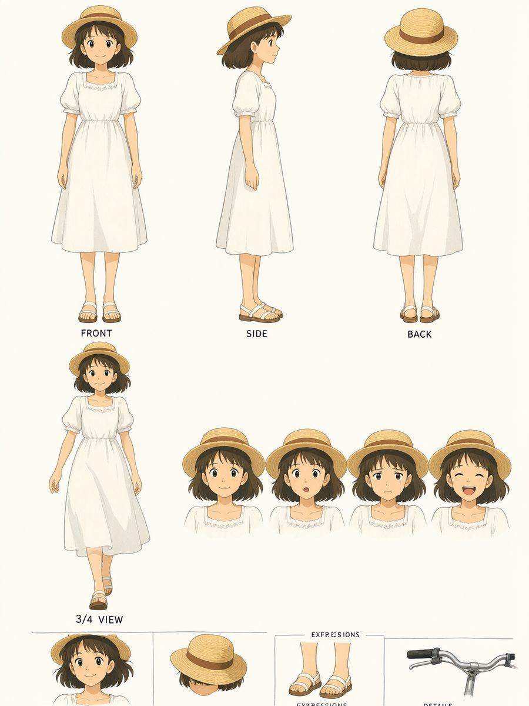
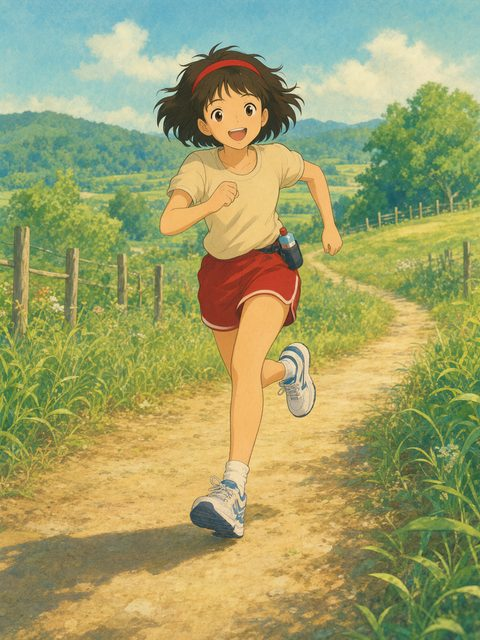
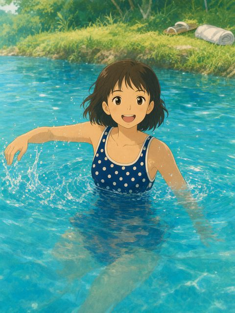
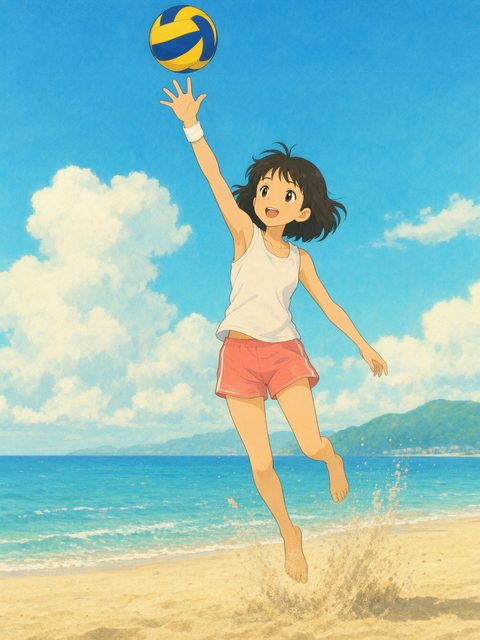
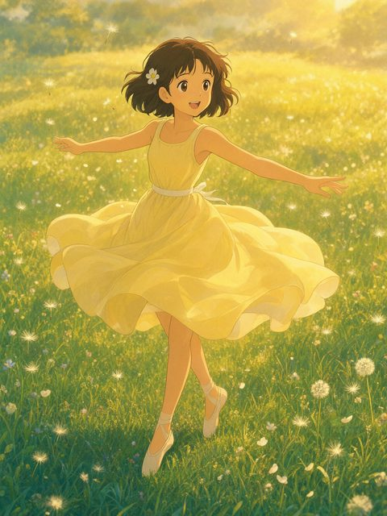

# dsh-character-card

Turn **one image of any character** into a production-ready character design card (角色卡)
using ComfyUI + **Qwen-Image-2.1** reference mode: front / side / back full-body views and a 45° walking view
(four full-body views with `--split`), a set of facial expressions, and detail crops — all identity-locked to the input
image — plus a reusable verbatim character block for downstream consistency.

## The problem it solves

When you generate a character across many images (a picture book, comic, or series), the
face drifts: page 1 and page 10 look like different people. Describing the character in
words helps but cannot carry a face. A character card solves it twice:

1. It renders the character in standardized views (转面), expressions and detail crops in
   one sheet, so you can *see* the canonical design.
2. The sheet (or the original image) feeds Qwen-Image-2.1's multimodal text encoder
   (`TextEncodeQwenImageEdit`) as a reference, which carries far more identity signal
   than any text block.

## Prerequisites

- A reachable ComfyUI server with Qwen-Image-2.1 loaded:
  - `qwen_image_2.1_bf16.safetensors` (diffusion model)
  - `qwen3vl_8b_bf16.safetensors` (text encoder)
  - `qwen_image_2.1_vae_bf16.safetensors` (VAE)
- Python 3.9+ with Pillow (`pip install pillow`)
- Server URL via `--server` or the `COMFYUI_SERVER` env var (default `http://127.0.0.1:8188`)

## Quick start

Install from the repository root with `./install.sh dsh-character-card`, then
reload your DSH session. For direct CLI use, enter the skill directory first:

```bash
# From the repository root; for a user install, use "${DSH_HOME:-$HOME/.dsh}/skills/dsh-character-card"
cd skills/dsh-character-card
python3 -m pip install pillow
```

Resolve `scripts/char_card_gen.py` relative to this skill's directory, not the
user's project working directory. Pass an absolute input image path when changing directories.
The default sheet has front/side/back full-body views and a 45° walking
three-quarter-length view; use `--split` for four full-body standing views.

```bash
# Minimal: card from any character image
python3 scripts/char_card_gen.py /path/to/character.png

# Full control
python3 scripts/char_card_gen.py girl.png \
    --name Mio \
    --style "Ghibli-style watercolor anime" \
    --expressions "gentle smile;surprised;sad teary eyes;laughing" \
    --details "face, hair and straw hat;hands, footwear and carried items" \
    --server http://127.0.0.1:8188

# Two roomier cards instead of one dense sheet
python3 scripts/char_card_gen.py girl.png --split
```

Outputs land in `<image_dir>/charcard/`:

- `<name>-card.png` — the character card (or `-card-poses.png` + `-card-expressions.png` with `--split`)
- `<name>-block.md` — verbatim character block skeleton; fill the wording from the
  reference image, then paste it identically into every downstream prompt

## Sample output

Character card generated from a single illustration (1008×1344, ~47 s on a dedicated GPU box):



The same card as a reference then drives scene-consistent action shots — outfit swapped
per scene while face and hair stay locked:

| Running | Swimming | Volleyball | Dancing |
|---------|----------|------------|---------|
|  |  |  |  |

## File layout

```
dsh-character-card/
├── SKILL.md                    ← agent-facing instructions
├── README.md                   ← this file
├── workflows/
│   └── char-card-3x4.json      ← ComfyUI API workflow ({{prompt}}/{{ref}}/{{seed}})
├── scripts/
│   └── char_card_gen.py        ← CLI driver
└── docs/images/                ← sample output
```

## How identity lock works

1. The input image is converted to RGB and resized so both sides are multiples of 32
   (avoids the adaptive-pooling error), then uploaded via ComfyUI `/upload/image`.
2. `LoadImage` feeds the reference into `TextEncodeQwenImageEdit` together with the
   sheet-layout prompt; Qwen3-VL carries face/hair/proportions as image features.
3. View positions are pinned by x-percentages (LEFT 18% / CENTER 50% / RIGHT 82%) —
   diffusion models drift left-right order on unpinned multi-figure sheets.
4. To change the character's outfit in a derived scene while keeping the face, say so
   explicitly in the prompt ("She is NOT wearing her usual dress in this scene; she
   wears …") — otherwise the strong identity lock pulls the original outfit back in.

## Limitations

- Qwen-Image-2.1 is illustration-tuned; photo-real humans read slightly painterly.
- Small label text on the sheet can render imperfectly — labels are cosmetic.
- Identity lock degrades for extreme angles or occlusions in the source image; the
  cleanest input is one clear full- or half-body view.
- No LoRA/IP-Adapter training — consistency comes from reference conditioning only.

## License

MIT — see the repository root [`LICENSE`](../../LICENSE).
