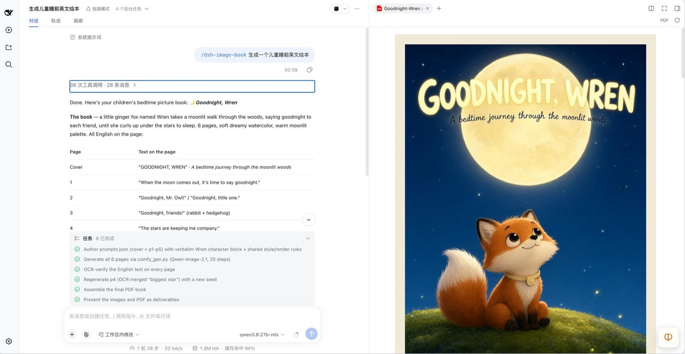
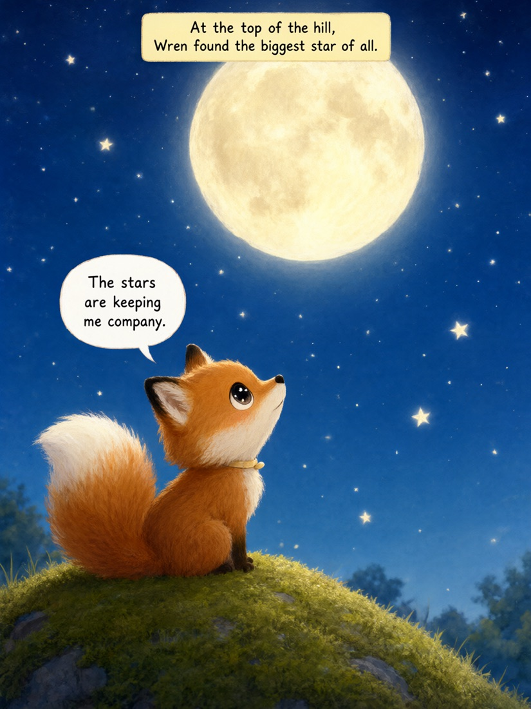

# dsh-image-book

> An end-to-end skill for generating English picture-comic books (绘本 / 漫画) with a local [ComfyUI](https://github.com/comfyanonymous/ComfyUI) server and [Qwen-Image-2.1](https://huggingface.co/Comfy-Org/Qwen-Image-2.1).

Turns a one-line brief into a finished PDF: story design → page prompts with locked character descriptions → generation → OCR verification of every rendered English caption → bound PDF. No cloud rendering fees, no per-image API cost.



<p align="center">
  
  
  
</p>

<p align="center"><em>Output from a real run: <code>Goodnight, Wren</code>, 6 pages, 1008×1344, 25 steps, Qwen-Image-2.1 on a local ComfyUI server.</em></p>

---

## What you get

- A **4-phase workflow**: Design → Author Prompts → Generate & Verify → Assemble PDF
- **5 reusable scripts**: ComfyUI driver, OCR verifier, two Swift OCR backends, PDF assembler
- **4 ComfyUI workflow templates**: text-to-image (25 / 15 steps) plus one- and multi-reference edit templates
- **4 example prompt files** covering different structural patterns (short story, atmospheric, restrained, ensemble cast)
- **6 documented pitfalls** learned from real failures across 4 books and 32+ rendered pages

This is **engineering infrastructure**, not a content library. It ships no finished stories — you supply the subject matter.

---

## Install

A skill is just a directory containing `SKILL.md`. DSH discovers skills from, in order of precedence:

| Scope | Location |
|-------|----------|
| Project | `<project-root>/.dsh/skills/` or `<project-root>/.agents/skills/` |
| User | `$DSH_HOME/skills/` (default `~/.dsh/skills/`) or `~/.agents/skills/` |

Pick one:

```bash
# user-wide, available in every project
mkdir -p ~/.dsh/skills
cp -R dsh-image-book ~/.dsh/skills/

# or project-local, committed alongside your book project
mkdir -p .dsh/skills
cp -R dsh-image-book .dsh/skills/
```

Reload the DSH session, then just ask for a picture book — the skill is selected by the `description` in its frontmatter.

---

## Prerequisites

- **macOS** — the OCR verification path uses the Swift Vision framework (`ocr_*.swift`). On Linux, swap in another OCR backend inside `ocr_verify.py`.
- **Python 3.9+** with `PIL` and `numpy`. Everything else (`urllib`, `json`) is stdlib — there is no `requirements.txt` by design.
- **Swift CLI** — ships with Xcode Command Line Tools (`xcode-select --install`).
- **A reachable ComfyUI server** — local or on your LAN. `comfy_gen.py` reads it from `COMFYUI_SERVER` (default `http://127.0.0.1:8188`).
- **Qwen-Image-2.1 weights** loaded in ComfyUI:
  - `qwen_image_2.1_bf16.safetensors` (diffusion)
  - `qwen3vl_8b_bf16.safetensors` (text encoder)
  - `qwen_image_2.1_vae_bf16.safetensors` (VAE)

  Quantized deployments work too — copy a template and change the loader file names to match what your server has.

---

## Quick start

```bash
cd dsh-image-book

# 1. Learn the prompt structure from an example
python3 -m json.tool examples/short-story.json | head -60

# 2. Copy it and write your own story
cp examples/short-story.json my-book.json
#    edit my-book.json: seeds, prompts, output file names
#    pages generate in file order — a charsheet entry must come first
#    add "ref": "bloom-character-sheet.png" to a page to switch it to reference mode

# 3. Generate
export COMFYUI_SERVER=http://127.0.0.1:8188
python3 scripts/comfy_gen.py --list --prompts my-book.json
python3 scripts/comfy_gen.py --prompts my-book.json --all

# 4. Verify the English text actually rendered
python3 -c "
import sys; sys.path.insert(0, 'scripts')
from ocr_verify import verify
verify('my-book-p1.png', ['When the moon comes out,', 'it is time to say goodnight.'])
"

# 5. Bind the PDF
python3 scripts/make_book_pdf.py \
    --title "My Book" --out My-Book.pdf \
    --pages my-book-cover.png,my-book-p1.png,my-book-p2.png \
    --gutter 84 --bg "#F2EAD9" --rounded
```

At 25 steps a 1008×1344 page takes roughly **2 minutes on an Apple-silicon Mac** and **60-70 seconds on a dedicated GPU box**.

---

## Two consistency modes

Character consistency is the hard part of any multi-page book. The driver supports both approaches and picks the template automatically, per page:

| Mode | How to trigger | Template | Use for |
|------|----------------|----------|---------|
| **Text-to-image** | no `ref` field | `qwen21-3x4.json` | one simple character, short books, drafts |
| **Reference (1 image)** | `"ref": "sheet.png"` | `qwen21-edit-3x4.json` | a recurring protagonist across many pages |
| **Reference (2-3 images)** | `"refs": ["a.png", "b.png"]` | `qwen21-editplus-3x4.json` | ensemble casts, group scenes |

In reference mode the character sheet is encoded through the multimodal text encoder instead of being described in words, which holds identity far better across re-framing. Generate the character sheet page first, then point later pages at its output file name. Reference files are uploaded to ComfyUI automatically and cached per run.

A controlled A/B (same seed, same scene, text-only vs text + reference) came out roughly even for a *simple single-character* scene — so treat reference mode as the tool for long books and multi-character work, not as a universal upgrade. See [`SKILL.md`](SKILL.md) for the full measurement.

---

## Repository layout

```
dsh-image-book/
├── README.md                    ← you are here
├── SKILL.md                     ← the skill itself: full workflow + pitfalls
├── LICENSE                      ← MIT
├── .gitignore
├── docs/images/                 ← README screenshots and sample output
├── scripts/
│   ├── comfy_gen.py             ← ComfyUI driver: template pick, ref upload, submit, poll, download
│   ├── ocr_verify.py            ← OCR + Levenshtein-tolerant text verification
│   ├── ocr_vision.swift         ← Swift Vision OCR backend (plain text)
│   ├── ocr_boxes.swift          ← Swift Vision OCR backend (bounding boxes)
│   └── make_book_pdf.py         ← generic PDF assembler
├── workflows/
│   ├── qwen21-3x4.json          ← 25 steps, portrait 1008×1344 (default)
│   ├── qwen21-3x4-s15.json      ← 15 steps (faster, riskier — see pitfalls)
│   ├── qwen21-edit-3x4.json     ← 1 reference image
│   └── qwen21-editplus-3x4.json ← 2-3 reference images
└── examples/
    ├── short-story.json         ← 7 pages, 1 protagonist, charsheet + dialogue heavy
    ├── atmospheric.json         ← 5 pages, horror / grotesque
    ├── restrained.json          ← 6 pages, sparse dialogue, caption narration
    └── ensemble-cast.json       ← 13 pages, 5 characters, many group scenes
```

The example prompt files are **structural references** — read them for prompt anatomy, not for content.

---

## The pitfalls this pipeline exists to solve

1. **Character drift** — the same description block must appear verbatim in every prompt, or use reference mode. One changed word compounds over 6+ pages.
2. **Multi-character layout drift** — with 4+ characters, Qwen reorders them to please the composition. Pin each with an absolute x-coordinate.
3. **The driving model often cannot see the generated image** — so the pipeline verifies text with OCR, plus file-size / dimension / bounding-box checks, instead of trusting a visual read.
4. **Placeholders are substituted strictly** — a leftover `{{ref}}` aborts the run rather than silently sending a broken graph.
5. **Swift + Vision needs `-fmodules-cache-path`** under the macOS sandbox; the scripts already pass it.
6. **OCR is fuzzy** — macOS Vision reads `m` as `n` and drops spaces, so matching is Levenshtein-≤2 per word rather than substring.

Full symptom → fix detail for each is in [`SKILL.md`](SKILL.md).

---

## What this skill does NOT do

- Video generation
- Photo-realistic portraits (Qwen-Image-2.1 is illustration-tuned)
- Consistency beyond prompt discipline + reference conditioning (no LoRA or IP-Adapter training)
- Translated multi-language editions (on-image text is English-only by design)
- Print-ready bleeds / CMYK (the PDF is RGB, screen-ready)

For LoRA / IP-Adapter / regional prompting / ControlNet at production quality, bring your own ComfyUI workflow and drive it with `comfy_gen.py`'s patterns.

---

## License

MIT — see [`LICENSE`](LICENSE).
